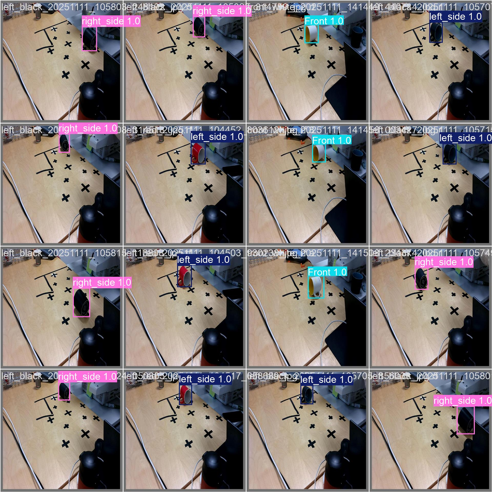

# Cup Orientation Detection Model

**Created by: Mahmoud Ayoub**

---

## 📋 Overview

This folder contains the trained YOLOv8 model for detecting cups in various orientations, along with training scripts and performance metrics. The model is a core component of the robotic dishwasher system, enabling the YuMi robot to identify and grasp cups in different positions.

---

## 🎯 Model Information

- **Model File**: `YOLO8n_Model.pt` (50.8 MB)
- **Architecture**: YOLOv8n (Nano variant)
- **Framework**: Ultralytics YOLO
- **Performance**: **99.48% mAP@50**
- **Training Platform**: Google Colab
- **Input Size**: 640x640 pixels

---

## 🏷️ Detected Classes (8 Classes)

The model detects cups in six different orientations, plus additional objects:

### Cup Orientations:
1. **Back** - Cup handle facing away
2. **Front** - Cup handle facing forward
3. **left_side** - Cup tilted to the left
4. **right_side** - Cup tilted to the right
5. **upright** - Cup standing normally
6. **upside_down** - Cup inverted

### Additional Objects:
7. **Gripper** - Robot gripper detection
8. **handle** - Cup handle detection

---

## 📊 Training Results

### Model Performance Metrics

The model achieved exceptional performance across all metrics:


*Sample validation predictions showing accurate cup orientation detection*

### Confusion Matrix


*Confusion matrix demonstrating high classification accuracy across all 8 classes*

### Training Metrics


*Comprehensive training metrics including mAP, precision, recall, and loss curves*

**Key Achievements:**
- **mAP@50**: 99.48%
- **Precision**: High accuracy in positive predictions
- **Recall**: Excellent detection rate with minimal false negatives
- **Robust Performance**: Consistent results across all cup orientations

---

## 📁 Folder Contents

```
Training_Model/
│
├── YOLO8n_Model.pt                          # Trained model weights (50.8 MB)
├── Cup_Orientation_Training_Colab.ipynb     # Google Colab training notebook
├── capture_training_images.py               # Script for capturing training images
├── Model_classes.py                         # Class definitions for the model
├── val_batch2_pred.jpg                      # Validation predictions visualization
├── confusion_matrix.png                     # Model confusion matrix
├── results.png                              # Training metrics and curves
└── ReadMe.md                                # This file
```

---

## 🔄 Retraining Instructions

If you need to retrain or fine-tune the model, follow these steps:

### Prerequisites
- Google Colab account (for GPU access)
- Roboflow account (for dataset management)
- Python 3.8+
- Ultralytics YOLO library

### Step 1: Prepare Training Data

Use the provided script to capture new training images:

```bash
python capture_training_images.py
```

This script will:
- Connect to the OAK-D camera
- Capture images at various angles
- Organize images for annotation

### Step 2: Annotate Dataset

1. Upload images to Roboflow
2. Annotate cups with bounding boxes
3. Label each cup with the correct orientation class
4. Export dataset in YOLOv8 format

### Step 3: Train Model in Google Colab

Open `Cup_Orientation_Training_Colab.ipynb` in Google Colab:

```python
# Key training parameters used:
- Model: YOLOv8n
- Epochs: 100+ (until convergence)
- Image size: 640x640
- Batch size: 16
- Optimizer: Adam
- Data augmentation: Enabled (flip, rotate, brightness)
```

### Step 4: Validate Model

After training:
1. Review confusion matrix for class accuracy
2. Check validation predictions
3. Verify mAP@50 score (target: >95%)
4. Test on real-world scenarios

### Step 5: Deploy Model

Replace the old model in your project:

```bash
# Rename your trained model
mv best.pt YOLO8n_Model.pt

# Copy to project directory
cp YOLO8n_Model.pt /path/to/PythonToRapid/
```

Update the model path in `cup_detector.py` if necessary:

```python
self.detector = CupDetector(
    model_path='YOLO8n_Model.pt',  # Updated model name
    confidence_threshold=0.6
)
```

---

## 🛠️ Model Classes Definition

The `Model_classes.py` file contains the orientation vector mappings:

```python
orientation_map = {
    'Back': [-1.0, 0.0, 0.0],
    'Front': [1.0, 0.0, 0.0],
    'left_side': [0.0, -1.0, 0.0],
    'right_side': [0.0, 1.0, 0.0],
    'upright': [0.0, 0.0, 1.0],
    'upside_down': [0.0, 0.0, -1.0]
    'handle': [0.0, 0.0, 0.0]
    'gripper': [0.0, 0.0, 0.0]
}
```

These 3D directional vectors are used by the robot to determine the correct grasping approach.

---

## 💡 Training Tips

### For Better Results:
- **Diverse Angles**: Capture cups from multiple viewpoints
- **Lighting Variations**: Train with different lighting conditions
- **Background Diversity**: Include various surface textures and colors
- **Data Augmentation**: Enable flips, rotations, and color jittering
- **Balanced Dataset**: Ensure equal representation of all orientations

### Common Issues:
- **Overfitting**: Use more augmentation and regularization
- **Poor Detection**: Increase dataset size and training epochs
- **Class Confusion**: Add more examples of confused classes
- **Low Confidence**: Lower confidence threshold or improve image quality

---

## 📈 Model Integration

This model is integrated into the vision system through `cup_detector.py`:

```python
# Detection pipeline
1. YOLO inference → Bounding boxes + class predictions
2. Orientation mapping → 3D directional vectors
3. Pose estimation → Full 6DOF pose in robot coordinates
4. Robot communication → Cup data sent to YuMi
```

---

## 🔗 Related Files

- **Main Detection**: `../main.py`
- **Cup Detector**: `../src/cup_detector.py`
- **Pose Estimator**: `../src/pose_estimator.py`
- **Camera Manager**: `../src/camera_manager.py`

---

## 📝 Version History

- **Current Version**: YOLO8n_Model.pt (99.48% mAP@50)
- **Previous**: best_cup_orientation_New.pt
- **Training Date**: November 2025

---

## 📧 Contact

**Created by: Mahmoud Ayoub**

For questions about model training or improvements, please refer to the main project documentation.

---

## 🎓 Acknowledgments

- **Framework**: Ultralytics YOLOv8
- **Dataset Management**: Roboflow
- **Training Platform**: Google Colab
- **Hardware**: OAK-D Pro Camera

---

**Last Updated**: November 17, 2025