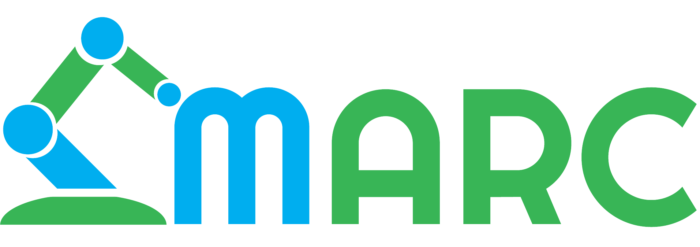

<h1 align="center">
  Dishwasher Loading And Unloading Robot
  <br>
  <br>
  
  <br>
  <br>
  <br>
</h1>

<h4 align="center">A robot arm with a vision system capable of picking up and placing cups. </h4>


<p align="center">
  <a href="#key-features">Key Features</a> •
  <a href="#requirements">Requirements</a> •
  <a href="#how-to-clone-git">How To Clone Git</a> •
  <a href="#get-started">Get Started</a> •
  <a href="media\Guide\Yumi IRB 14000\RAPIDstart.md">Rapid</a> •
  <a href="media\Guide\Python\README.md">Python</a> •
  <a href="media\Guide\Yumi IRB 14000\README.md">YuMi IRB 14000</a> •
</p>


The project aims to create a robotic system capable of dynamically locating different kinds of mugs in different orientations and correctly picking them up using a **Dual Arm YuMi**.
## Key Features

* Dynamic robot capable of picking up and placing mugs in a predefined position.

* Object awareness
  - Identifies mugs, their postion and pose.

* Components used
  - YUMI IRB14000
  - OAK-D PRO Camera
* Languages used
  - Python
  - RAPID


## Requirements
  - Python 3.11
    - OpenCV
    - DepthAI
    - Numpy
<!--
  Lägg in mer här?
-->
  - Robotstudio
    - RobotWare
  - YUMI IRB 14000
## How To Clone Git

Clone this repo , you'll need [Git](https://git-scm.com) installed on your computer. From your command line:

```bash
# Clone this repository
$ git clone https://github.com/MDU-C2/MARC-HT25.git

# Go into the repository
$ cd MARC-HT25
```
> [!Note]
> Everything in this guide was tested on windows
> 
## Get Started

There are two parts to this software, the Robot side (RAPID) and the camera side (Python). Follow the [YuMi IRB 14000](/media/Guide/Yumi%20IRB%2014000/README.md) guide for how to work with the robot and [Python guide](/media/Guide/Python/README.md) for setting up Python and the camera to communicate with the robot.

**If this is your first time working in this project, it is sugessted to follow the [step by step guide](/media/Guide/step_by_step_guide.md).**
## Rapid
Rapid is the language to program the [YuMi IRB 14000](/media/Guide/Yumi%20IRB%2014000/README.md). It is used to do the following parts of the project.
- [Get started](/media/Guide/Yumi%20IRB%2014000/RAPIDstart.md)
- [Communication](/media/Guide/Yumi%20IRB%2014000/communication_rapid.md)
- [Move arm](/media/Guide/Yumi%20IRB%2014000/move_arm.md)

## Python
- [Python](/media/Guide/Python/README.md)
- [Run Python code](/media/Guide/Python/running_code.md)

## YuMi IRB 14000
[YuMi IRB 14000](/media/Guide/Yumi%20IRB%2014000/README.md) is the robot used. It currently boot with system failure, to solve this and to get started follow the links down below. 
- [Start the system](/media/Guide/Yumi%20IRB%2014000/how_to_start_rapid.md)
- [System failure](/media/Guide/Yumi%20IRB%2014000/systemfailure.md)
## License

MIT

---

## Other

Readme template by Amit Merchant