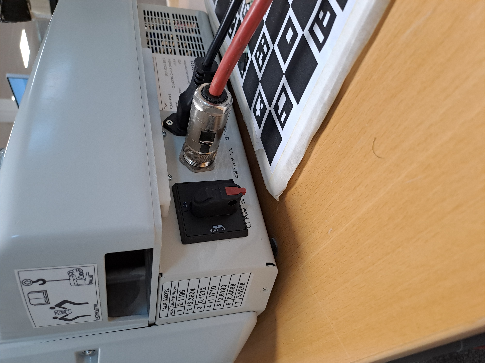

# Step by step guide
Here you will follow a step by step guide to set everything up to run the system.

## Content/Quickstart
1. <a href="#1-clone-the-repo">Clone the Repo</a>
2. <a href="#2-setup">Setup</a>
    - <a href="#rapid-setup">RAPID-setup</a> - [(guide link)](/media/Guide/Yumi%20IRB%2014000/RobotStudio_setup.md)
    - <a href="#python-setup">Python-setup</a> - [(guide link)](/media/Guide/Python/README.md)
    - <a href="#robot--camera-setup">Robot/Camera-setup</a> - [(guide link)](/media/Guide/Yumi%20IRB%2014000/RobotStudioconnect.md)
3. <a href="#3-run-the-code">Run the code</a>
    - <a href="#rapid-code">RAPID code</a> - [(guide link)](/media/Guide/Yumi%20IRB%2014000/how_to_start_rapid.md)
    - <a href="#python-code">Python code</a> - [(guide link)](/media/Guide/Python/running_code.md)
## 1. Clone the Repo
Start by making a clone of this repo , you'll need [Git](https://git-scm.com) installed on your computer. From your command line:

```bash
# Clone this repository
$ git clone https://github.com/MDU-C2/MARC-HT25.git

# Go into the repository
$ cd MARC-HT25
```


## 2. Setup
This section goes through how to start the robot and configure **RobotStudio** and **Python** settings in order to run the code in this repository.

### Starting YuMi
Start the YuMI by turning the power knob at the base of the robot.


<h1 align="center">
  <br>
  
  <br>
</h1>


>[!Note]
 >If you are using the same YuMI IRB14000 as we did you should read how to fix the [system failure](/media/Guide/Yumi%20IRB%2014000/systemfailure.md) error. This should not be a problem though as it seems it was fixed by a person at ABB near the end of the project period.

### Robot / camera-setup
Connect the YuMi robot to the computer you are working on by following [this guide](/media/Guide/Yumi%20IRB%2014000/RobotStudioconnect.md)

>[!Note]
>If you get a [system failure](/media/Guide/Yumi%20IRB%2014000/systemfailure.md) error, it can solved by following this [link](/media/Guide/Yumi%20IRB%2014000/systemfailure.md).

 Lastly set up the camera so that it can see the whole work space of the robot.

### RAPID-setup
If the RAPID code is already on the robot, you can skip over to the <a href="#python-setup">Python-setup</a>. However, if you want to set up a simulated controller or load/modify RAPID code on the YuMi, continue with the following steps.


The easiest way to modify and run RAPID code is by using **RobotStudio**. You can start a [30-day free trial](https://new.abb.com/products/robotics/nl/software-and-digital/robotstudio/robotstudio-desktop) through the ABB website or you can ask a teacher or the IT department to make **RobotStudio** available in the **Software Center** on any school computer. 


<!-- ÄNDRA TILL RÄTT FILNAMN / MAPPNAMN / TASKNAMN -->
When you have **RobotStudio**, you need to include the programs **Communication,Left_arm,Right_arm** all found in seperate folders in **\MARC-HT25\Rapid\Main**. Make sure **Left_arm** is loaded onto the **T_ROBL** task and **Right_arm** is loaded to  **T_ROBR** task on the yumi. 

You can follow [these steps](/media/Guide/Yumi%20IRB%2014000/RobotStudio_setup.md) to configure the correct settings within **RobotStudio**.
>[!Note]
>It is possible to run the code on the YuMi through the flex pendant but RobotStudio offers a friendlier and easier to use interface.
### Python-setup
You can find all the necessary information about the Python setup by going through [this guide](/media/Guide/Python/README.md).

## 3. Run the code
Now that everything is set up correctly, you can run the system by following the steps in this section.

Make sure all the cables are connected, open RobotStudio and open either VsCode or powershell/cmd in the python main folder. 


### Rapid code
To start the robot system, select all the **Tasks** in **RobotStudio**, reset the pointers (Ctrl+Shft+M) and start the system(F8).

The system should start and wait for a connection with the vision system.

For more indepth intstructions follow the [start RAPID guide](/media/Guide/Yumi%20IRB%2014000/how_to_start_rapid.md).
>[!Note]
>If the connection is lost during runtime, the system may need to be restarted.


<!-- ÄNDRA TILL RÄTT FILNAMN -->
### Python code
First the camera needs to be callibrated, make sure the robot system is running. Then start the **calibrate_single_file.py**. Here the camera should pop up in a new window and you should see the view of the camera. Choose the amount of positions and starting position and the system should outocalibrate for you.

When the calibration is done start the **MAIN PYTHON FILE HERE** and the system is ready. If everything is set up properly, you should be able to place mugs in the YuMi workspace (infront of the robot) and it should automatically try to move the mug.

For more indepth instructions follow the [start python guide](/media/Guide/Python/running_code.md).
